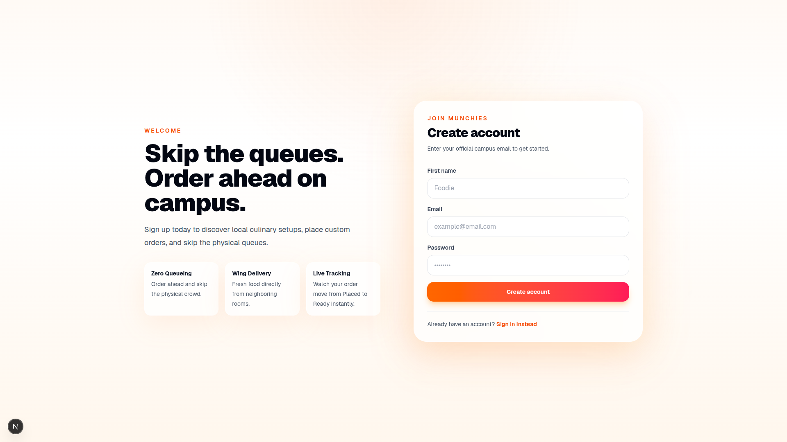
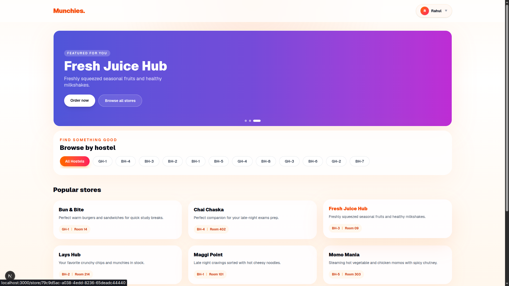
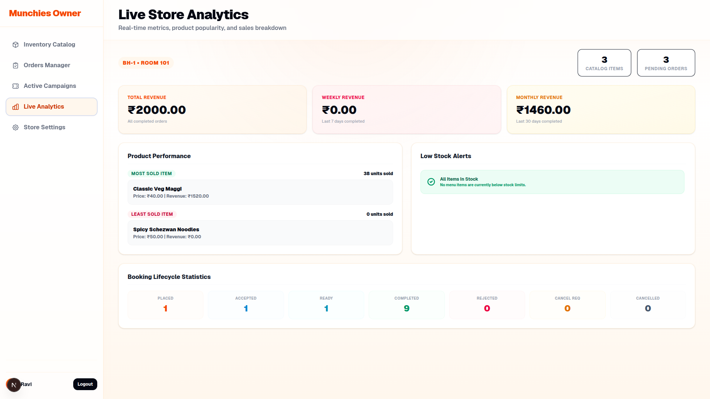
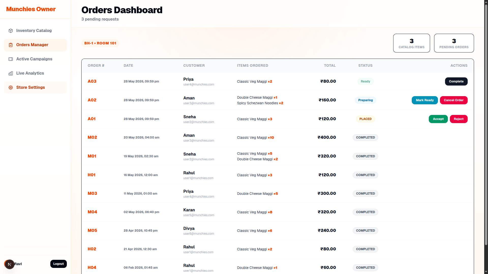
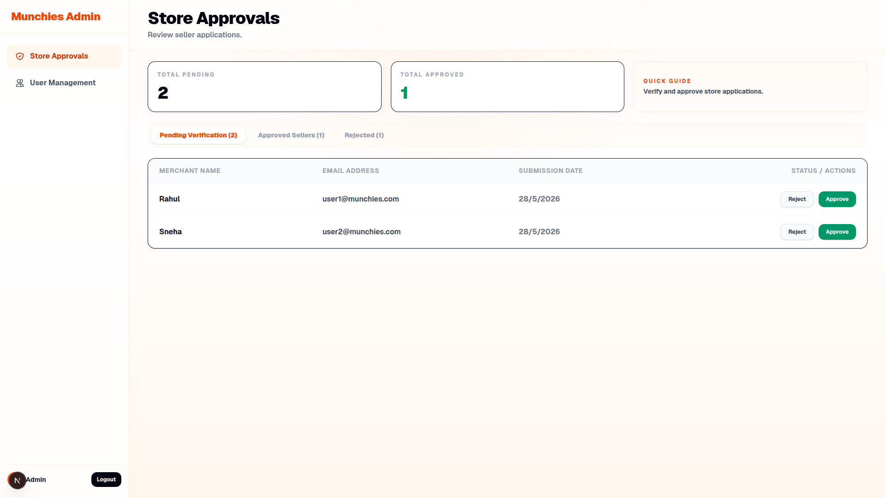
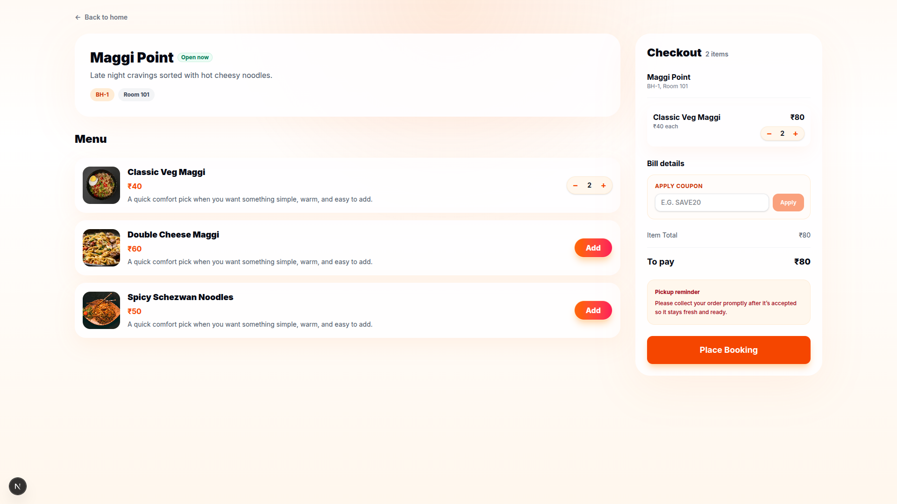
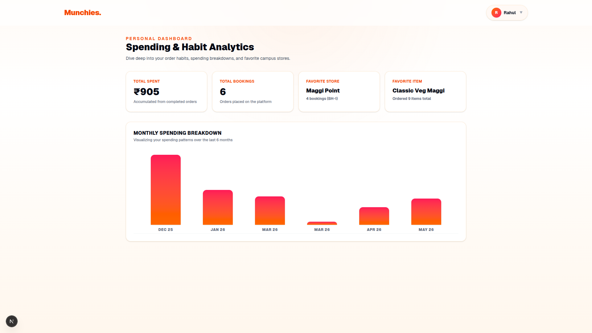

# Munchies Platform — Feature Guide

This guide explains the core features, caching designs, background loops, and user interfaces of the Munchies platform.

---

## 1. Student Portal & Wing Catalog

The student interface allows campus residents to register, sign in, browse hostel wing kitchens, and manage their orders.

### Registration & Login

Students sign up and log in securely.

### Hostel Kitchen Catalog

Students can browse active wing kitchens in their selected hostels. Each card displays store details, hostel room numbers, and marketing taglines.

---

## 2. Store Settings & Analytics

Kitchen operators can customize their kitchen details and view live performance metrics.

### Store Settings

Located in the owner dashboard (`/owner`), this panel lets operators manage their brand name and tagline:

* **Live Preview**: The student catalog preview card updates in real-time as the owner types.
* **Launch Announcement**: Owners can send a one-time launch notification email to all subscribed campus students if the store is less than 7 days old.

### Store Analytics

Operators can track revenue, sales metrics, and low-stock alerts.

---

## 3. Store Owner Application

Students can apply to become store owners directly from the owner login screen by switching to the "Apply for Store Ownership" tab. Submitting the application creates a pending request for campus administrators to review.

---

## 4. Order Management & Booking Lifecycle

Store owners track and manage incoming bookings through their dashboard:

* **Lifecycle States**: Bookings progress through Placed ➜ Accepted ➜ Ready ➜ Completed/Cancelled states.
* **Ready Notification**: Setting an order status to `READY` triggers a notification alert for student pickup.

---

## 5. Campus Admin Portal

Campus administrators review pending store owner applications, issue warning flags to students who fail to collect orders on time, and enforce blocks on bad actors.

---

## 6. Caching & Checkout Flows

To ensure fast load times, wing kitchen listings and menu pages use an in-memory cache system. The cache automatically invalidates on database updates, stock checkouts, or settings changes to keep product listings accurate.

### Student Checkout

Students can checkout items from their shopping cart (up to 7 items per transaction) and apply coupon codes.

---

## 7. Personal & Spending Analytics

Students can view their 6-month spending chart and track their warnings history by visiting the user profile screen.

---

## 8. Background Schedulers

A background worker runs every 60 seconds to manage automated rules:

* **Uncollected Order Cleanup**: Cancels ready orders older than 24 hours, issues a student warning via email, and blocks ordering access if a student reaches 3 warnings.
* **Campaign Activation**: Automatically toggles promotional coupon codes based on their start and end dates.
